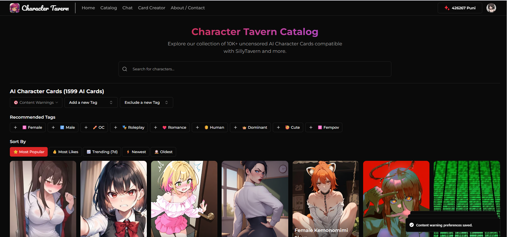

# How to Add Characters

Okay, so your SillyTavern is set up and ready to go. Now you need someone to talk to! In the world of SillyTavern, these are called **Character Cards**.

They're special `.png` image files that look like regular pictures but secretly contain all the data about a character—their personality, greeting, and everything else.

Here’s how to find and import them.

---

## Part 1: Find a Character You Like

There are two amazing websites where the community shares thousands of characters. You can spend hours just Browse!

* **[character-tavern.com](https'://character-tavern.com)** (Our sister site!) - A great, curated collection.
* **[chub.ai](https://chub.ai/)** - A massive, searchable archive of characters.

Go to either site and just look around until you find a character that seems interesting.

> 

---

## Part 2: Download the Character Card

Once you've found the perfect character, you need to download their `.png` card file. The process is slightly different for each site.

#### On Character Tavern:

Look for the big **"Download Character Card"** button on the character's page and click it. This will save the `.png` file directly to your computer.

> 

#### On Chub.ai:

On the character's page, you'll see a picture of the character. Simply **click on the "PNG" button** right below the image. That's the one you want!

> 

!!!warning Watch Out!
Make sure you download the actual `.png` file. Don't just right-click and "Save Image As," as that can sometimes mess up the special data inside the file. Always use the site's official download button.
!!!

---

## Part 3: Import The Character Into SillyTavern

You've got the card! Now let's introduce them to your tavern.

1.  In your SillyTavern interface, go to the character selection screen. It's usually the main page or accessible via a button with a character icon (👤).
2.  Click the **"Import Character"** button. It often looks like an upload icon.
3.  Select the `.png` file you just downloaded from your computer.

> 

And... that's it! The new character will appear in your list, ready to chat.

Now go have a great conversation!