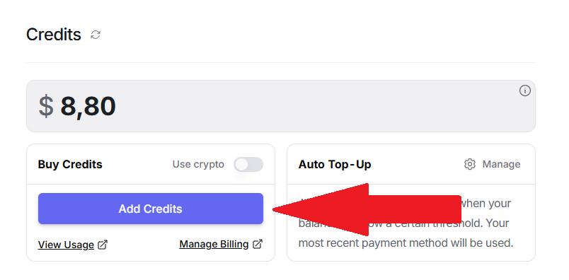
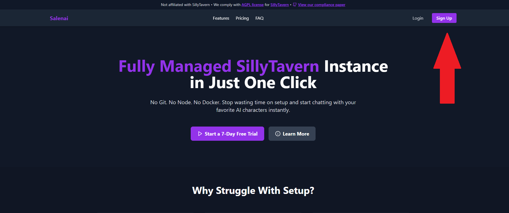
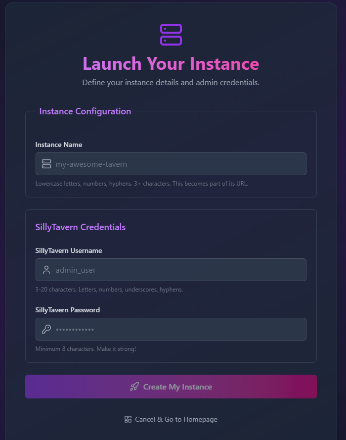

# Getting Started with Salenai

Hey! Welcome to the fastest way to get your own SillyTavern instance running. This guide will take you from zero to chatting in just a few minutes.

### First, a Quick Word on OpenRouter

To generate responses, SillyTavern needs to connect to an AI model. We use **OpenRouter** for this. Why?

Because it's awesome! It's a super easy-to-use service that gives you access to a huge variety of AI models—some are completely free, some are paid. You get one API key to access models from OpenAI, Anthropic (Claude), Google (Gemini), and many more. This gives you tons of choice without the headache of managing multiple accounts.

Let's get it set up!

---

## Part 1: Setting Up Your OpenRouter Account

This is where you'll get your API key to connect to the AI models.

### Step 1: Create an OpenRouter Account

Head over to [OpenRouter.ai](https://openrouter.ai/) and sign up for a free account.

### Step 2: Create Your First API Key

Once you're logged in, go directly to your [**API Keys page**](https://openrouter.ai/settings/keys) and click "Create Key". Give it a name (like "salenai") and create it.

> 

!!!danger Heads Up!
Copy this key and save it somewhere safe, like a password manager. **You will not be able to see it again!**
!!!

### Step 3: Add Credits (Optional but Recommended)

Many fantastic models on OpenRouter require credits. You can add as little as a few dollars to get started.

* Go to your [**Credits page**](https://openrouter.ai/settings/credits) and add your desired amount.

> 

### Step 4: Check Out the Models

Now the fun part! Go to the **Models** page on OpenRouter to see everything you now have access to. You can check the [rankings](https://openrouter.ai/rankings) to see the most popular models or browse the full [models page](https://openrouter.ai/models) to do your research.

> **Our Recommended Models to Start:**
> * **[Deepseek v3 0324 (Free)](https://openrouter.ai/deepseek/deepseek-chat-v3-0324:free):** A powerful free model that's great for getting started.
> * **[Deepseek v3 0324](https://openrouter.ai/deepseek/deepseek-chat-v3-0324):** The paid version with higher rate limits, speed, quality and priority access.
> * **[Claude 3.7 Sonnet](https://openrouter.ai/anthropic/claude-3.7-sonnet):** An amazing all-around model known for high-quality roleplaying.

---

## Part 2: Launching Your Salenai Instance

Now that you have your AI "engine" ready, let's get your SillyTavern "car" built.

### Step 5: Create Your Salenai Account

If you haven't already, go to [salenai.com](https://salenai.com) and create your account.
> 

### Step 6: Start Your Free Trial

Grab your 7-day free trial. You can cancel anytime, and we just use it to make sure everything's legit.
> 

### Step 7: Create Your Instance

This is the moment! From your dashboard, click "Create Instance". You'll see a simple form:

>

* **Instance Name:** This will become your public URL. Choose something cool! If you enter `my-awesome-tavern`, your URL will be `my-awesome-tavern.salenai.xyz`.
* **SillyTavern Username:** This is the username you'll use to log into your SillyTavern interface.
* **SillyTavern Password:** And the password to protect it. Make it a good one!

Click "Launch" and... that's it! Our magic robots will build your instance, which usually takes about 60 seconds.

### Step 8: Access Your Instance!

Once it's ready, your dashboard will show you the link to your brand new, personal SillyTavern instance. Click it, log in with the username and password you just created, and you're in!

> 

---

## Part 3: What's Next?

Okay, you're in! Your instance is running. Now it's time to connect it to OpenRouter and start chatting. Our next guide will walk you through that process step-by-step.

[➡️ **Next Up: Setting Up Your SillyTavern**](./Setting-up-sillytavern)