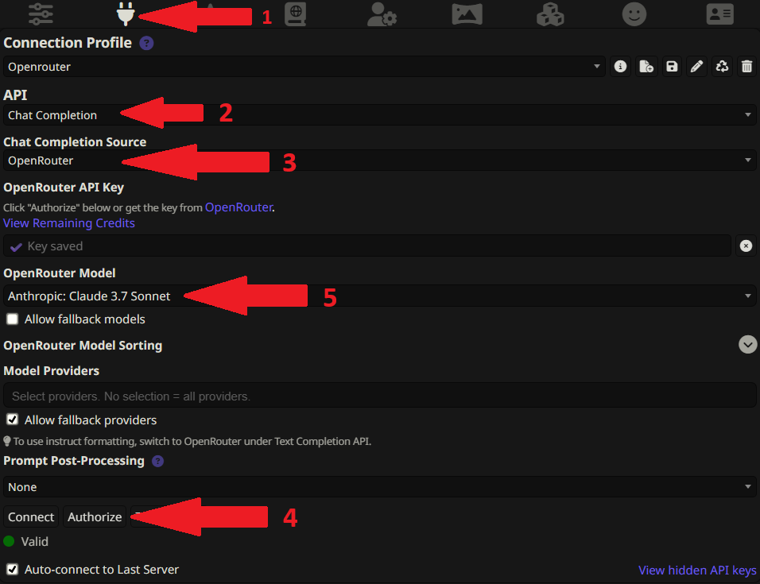

# Setting Up Your SillyTavern

Okay, your instance is live! This guide will take you through the final steps to get everything connected and optimized for the best possible chat experience.

---

## Part 1: Connecting to OpenRouter

First, let's tell SillyTavern how to talk to the AI models.

### Step 1: Open API Connections

Once you're logged into your SillyTavern instance, look for the API settings button in the top bar. It usually looks like a plug or a cloud icon. Click it.

### Step 2: Connect to OpenRouter

This part is super easy.

1.  For the **API**, make sure **'Chat Completion'** is selected.
2.  For the **Source**, select **'OpenRouter'** from the dropdown list.
3.  Click the **"Authorize"** button. A new window will pop up asking you to log into OpenRouter and approve the connection.
4.  Once authorized, click the big **"Connect"** button. A new model dropdown menu should appear. If it does, you're connected!
5.  Choose your preferred model from the dropdown. You can check the [OpenRouter models page](https://openrouter.ai/models) to see what's available.

> 

---

## Part 2: Supercharging Your Prompts & Jailbreaks

This is the secret sauce. A good preset dramatically improves the AI's creativity, coherence, and ability to follow instructions for roleplaying.

### How to Import a Preset

Most preset creators will provide a `.json` file for you to download. The process is simple:

1.  In the top bar, click the **"A"** icon to open the **"Prompt Formatting"** panel.
2.  At the bottom of this panel, find the "Import" button.
3.  Click it and upload the `.json` file you downloaded. The settings will be applied instantly.
4.  Give the preset a name at the top of the panel and click **"Save"**.

> 

### Recommended Presets

Here are some of the best places to find amazing presets. Remember to look for the `.json` download link!

* **Official SillyTavern Discord:** A goldmine for community-created presets. [https://discord.gg/sillytavern](https://discord.gg/sillytavern)
* **Smiley's Presets (Sal's Choice):** Incredible for both SFW/NSFW roleplay and uses advanced features. [https://rentry.org/SmileyJB](https://rentry.org/SmileyJB)
* **Pixi's Universal Prompts:** A fantastic resource and inspiration. [https://pixibots.neocities.org/#prompts/pixijb](https://pixibots.neocities.org/#prompts/pixijb)

### Activating Advanced Presets (like SmileyJB's with Regex)

Some of the most powerful presets require an extra step to work correctly. For example, many of Smiley's presets use the **Regex** extension to modify the prompt on the fly.

Here’s how to set it up:

1.  **Go to the Extensions Panel:** In the top bar, click the icon that looks like a puzzle piece (🧩) to open the **"Extensions"** panel.
2.  **Enable Regex:** Find "Regex" in the list and make sure the toggle switch next to it is **on (blue)**.

    > 
3.  **Configure Regex Based on the Preset:** Now, go back to the Prompt Formatting panel ("A" icon). At the very bottom, you'll see the Regex section. The preset you imported will have already filled this out, but you can customize it.

    !!!tip Read the Preset's Description!
    Preset creators like Smiley often include instructions in their Rentry page, like "Enable this if you want X, disable that if you want Y". This is where you toggle those features on or off in the Regex section to customize the jailbreak to your liking.
    !!!

    > 

---

### You're Done! For Real This Time!

That's it. Your instance is connected, and your prompts are supercharged. You are now 100% ready to have the best possible AI chat experience.

Go find a character, and have fun! You've earned it.