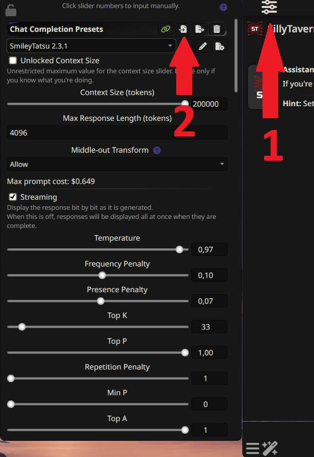
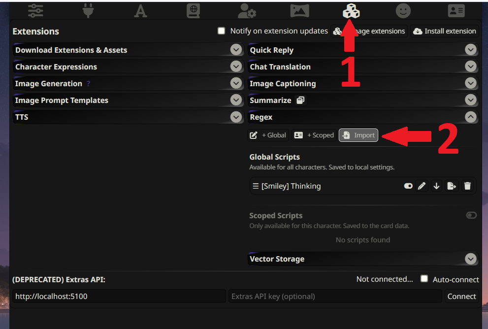
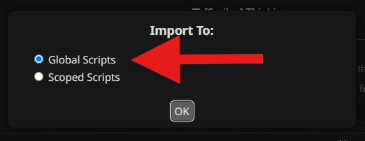
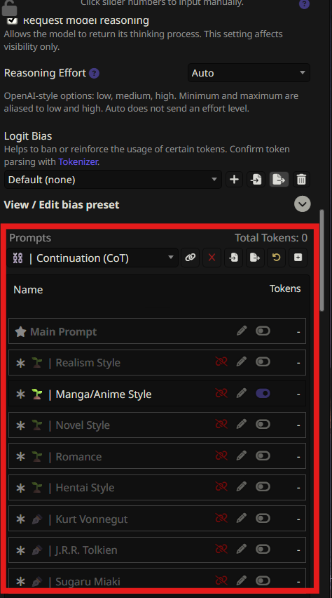

# Setting Up Your SillyTavern

Okay, your instance is live! This guide will take you through the final steps to get everything connected and optimized for the best possible chat experience.

---

## Part 1: Connecting to OpenRouter

First, let's tell SillyTavern how to talk to the AI models.

### Step 1: Open API Connections

Once you're logged into your SillyTavern instance, look for the API settings button in the top bar. It usually looks like a plug or a cloud icon. Click it.

### Step 2: Connect to OpenRouter

This part is super easy.

1.  For the **API**, make sure **'Chat Completion'** is selected.
2.  For the **Source**, select **'OpenRouter'** from the dropdown list.
3.  Click the **"Authorize"** button. A new window will pop up asking you to log into OpenRouter and approve the connection.
4.  Once authorized, click the big **"Connect"** button. A new model dropdown menu should appear. If it does, you're connected!
5.  Choose your preferred model from the dropdown. You can check the [OpenRouter models page](https://openrouter.ai/models) to see what's available.

> 

---

## Part 2: Supercharging Your Prompts & Jailbreaks

This is the secret sauce. A good preset dramatically improves the AI's creativity, coherence, and ability to follow instructions for roleplaying.

### Recommended Presets

Here are some of the best places to find amazing presets. Remember to look for the `.json` download link!

* **Official SillyTavern Discord:** A goldmine for community-created presets. [https://discord.gg/sillytavern](https://discord.gg/sillytavern)
* **Smiley's Presets (Sal's Choice):** Incredible for both SFW/NSFW roleplay and uses advanced features. [https://rentry.org/SmileyJB](https://rentry.org/SmileyJB)
* **Pixi's Universal Prompts:** A fantastic resource and inspiration. [https://pixibots.neocities.org/#prompts/pixijb](https://pixibots.neocities.org/#prompts/pixijb)

### How to Import a Preset

Most preset creators will provide a `.json` file for you to download. To import it into SillyTavern:

1.  In the top bar, click the **"Settings"** icon to open the **"Chat Completion Presets"** panel.
2.  At the top of this panel, find the "Import" button.
3.  Click it and upload the `.json` file you downloaded. The settings will be applied instantly.
4.  Give the preset a name at the top of the panel and click **"Save"**.

> 

### Activating Advanced Presets (like SmileyJB's with Regex)

Some of the most powerful presets require an extra step to work correctly. For example, many of Smiley's presets use the **Regex** extension to modify the prompt on the fly.

Here’s how to set it up:

1.  **Go to the Extensions Panel:** In the top bar, click the icon that looks like a puzzle piece (🧩) to open the **"Extensions"** panel.
2.  **Import the JSON File:** In the Regex section, click the **"Import"** button and upload the `.json` file you downloaded from Smiley's Rentry page. This will add the Regex extension to your SillyTavern instance and 

    > 
3. **Choose 'Global' for Regex:** Make sure to select **'Global'** in the Regex section. This ensures that the Regex rules apply to all chats, not just specific ones.

    > 

### Part 3: Configuring the Preset

Now that you've imported the preset, you need to configure it properly:

1. **Open Chat Completion Presets:** Click the **"Settings"** icon in the top bar and select **"Chat Completion Presets"**.

2. **Select Your Imported Preset:** Choose the preset you just imported from the dropdown menu.

3. **Configure the Settings:** Scroll down to the bottom of the panel. You'll see various toggles and options that need to be configured according to the preset's documentation.

4. **Follow the Documentation:** Each preset comes with specific instructions on which settings to enable/disable. Check the creator's documentation (like Smiley's Rentry page) for the exact configuration needed.

5. **Save Your Changes:** Once you've configured all the settings according to the documentation, click **"Save"** to apply your changes.

> 

---

### You're Done! For Real This Time!

That's it. Your instance is connected, and your prompts are supercharged. You are now 100% ready to have the best possible AI chat experience.

Go find a character, and have fun! You've earned it.